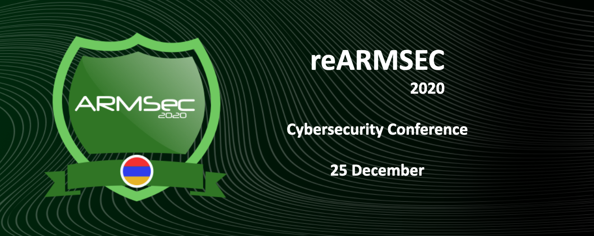

## Conferences

### reARMSEC 2020 
Annual Information Security Conference

### Friday, December 25, 2020

- [Facebook Event](https://www.facebook.com/events/3612982845485388/)
- [WebSite](https://armsec.org/)

#### Agenda

- Why web is hard, Top 10 and Beyond - David Karapetyan
- Security in ICS - Hrant Haroyan
- OS for 0 state laptop - Vahagn Poghosyan
- CyberSec Ethics - Ruben Muradyan
- History of Container Security - Antranig Vardanian
